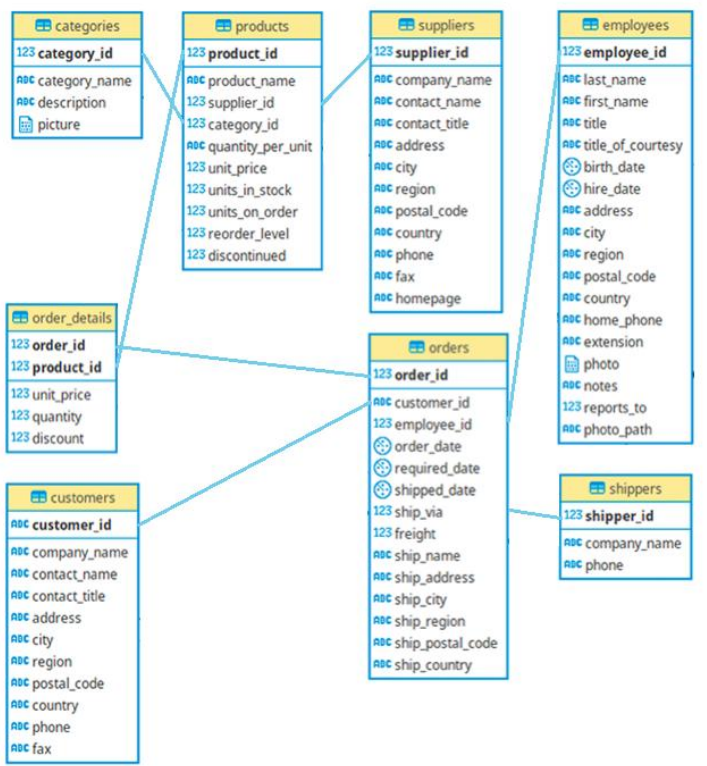
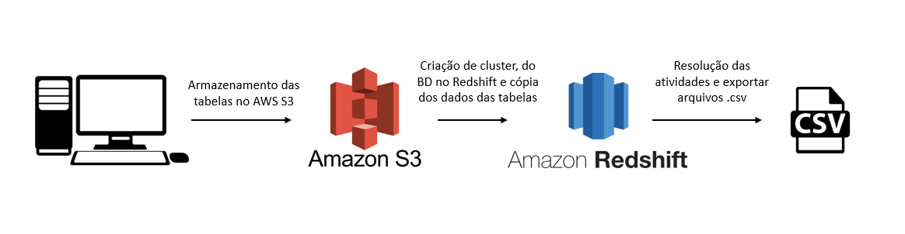

# Projeto1 - Datawarehouse Northwind

>Este projeto tem como objetivo resolver problemas de negócio simulados e fornecer soluções usando um Datawarehouse construído com tecnologias AWS, incluindo AWS Redshift, AWS S3 e um Banco de Dados Relacional.

## Contexto: 

A empresa fictícia possui um banco de dados que gerencia informações relacionadas a pedidos, produtos, clientes, fornecedores, colaboradores, entre outros.

## Estrutura do Banco de Dados:
O esquema do Banco de Dados Relacional é representado conforme a imagem abaixo:

<!-- colocar screenshoot do seu projeto -->

## Preparação do ambiente

Para realizar as atividades propostas, utilizou-se da seguinte estrutura:
 
* Criação de Cluster Redshift;
* Criação da estrutura do Datawarehouse Northwind ;
* Upload dos arquivos .csv do PC Local para um bucket no AWS S3;
* Cópia dos dados do AWS S3 para o datawarehouse no Redshift;
* Resolução das atividades que simulam problemas de negócios e exportação de csv.

## Atividades: 
 1. Gerar um relatório com os valores tabelados dos produtos e com os valores realmente executados nas vendas, exibindo a diferença entre esses valores e exibir a quantidade de produtos vendidos por venda.    

 2. Agrupar o valor das vendas dos vendedores no ano de 2022 para analisar o desempenho do vendedor "Robert King".

 3. Selecionar os 10 produtos que têm os preços tabelados mais caros.

4. Mostrar a quantidade de vendas total por fornecedor nos anos de 2021 e 2020 e a diferença entre o total de vendas desses anos.

5. Selecionar as 5 categorias que mais venderam em cada ano.

Link do curso: <https://www.udemy.com/course/engenheiro-de-dados/>